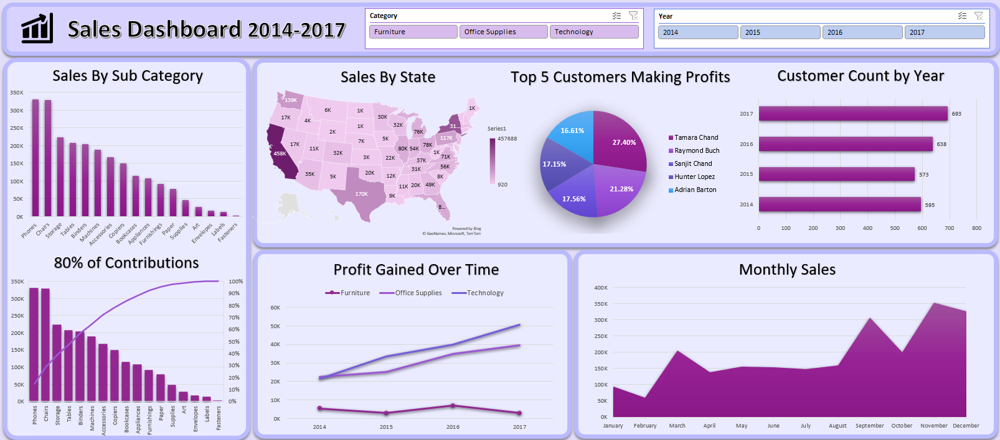

# Aura Store Sales Dashboard 2014-2017

Welcome to the Aura Store Sales Data Analysis Project! This project focuses on making a sales dashboard from 2014 to 2017 using Microsoft Excel.

## Project Objective

The store aims to create a sales dashboard for the period 2014 to 2017 to better understand its customers and drive sales growth in future years.

## Project Overview

### Data

You can see the dataset here [Store Dataset](./dataset.csv)

### SQL Analysis

Explore the following resources:

- [SQL Analysis Script:](./analysis.sql) The SQL script used for data analysis.
- [Query Results:](./analysis.docx) A document containing the results of the executed queries.
- [Database Backup (.bacpac):](./auraStore.bacpac) A backup file of the database, including its schema and data.

### Project

You can see the final project here [Project](./dashboard.xlsx)

### Conclusions

- California is the state with the highest sales ($460K)
- Tamara Chand, Raymond Buch and Snajit are the top 3 customers generating the most profit
- 2017 saw the highest increase in customers (693)
- Phones is the subcategory with the highest sales ($330K)
- November is the month with the highest sales ($350K)
- Technology is the category with the highest profit gained over time ($146K)
